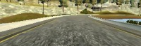

# Behavioral cloning

## Convolutional Neural Network Architecture

I designed a CNN based on the NVidia example, which has been able to successfully steer a real-world self-driving car without human intervention. The model consists of an input in the form of a 66x200 sized image which is fed into a CNN of 24 filters followed by a CNN of 36 filters followed by a CNN of 48 filters followed by 2 CNNs of 64 filters . I use strided convolutions in the first three convolutional layers with a 2×2 stride and a 5×5 kernel and a non-strided convolution with a 3×3 kernel size in the last two convolutional layers.I used exponential leaky units (ELU) for activation functions, because ELUs have smoother derivatives at zero, and hence are expected to be slighly better for predicted continuous values.I am using 'valid' padding to prevent introduction of unwanted edges in our resized data that may influence the network's prediction capabilities.

I have followed the five convolutional layers with four fully connected layers leading to an output control value that determines the steering angle of the car as an output. The fully connected layers are designed to function as a controller for steering. However as noted in the NVIDIA paper, it is not possible to distinguish as to which parts of the network perform feature extraction and which parts of the network perform the steering control.

I have not used any dropout layers in the architecture below as we are strictly following the NVIDIA architecture . Also in my tests, I saw a degradation in performance when I added dropout layers in between any of the layers shown below. We combat overfitting with data augmentation as described below. 

I am using the adam optimizer since it given good results in my previous experiences and we do not need to adjust the learning rates manually. 

The complete architecture of the model is summarized in diagram as below.

##Training process

### Training data 

The raw data that was to be used for training this model was the Udacity data. It consists of 8036 samples. We are using a generator to generate additional data, augmenting it with additional information and using the augmented data for training the model. The augmentation process is described as below

####Image augmentation and preprocessing

I have trained a new network from scratch vs using transfer learning and using qualities of a pre-trained network. Hence we would need a large amount of data for training the network from scratch.The data in the Udacity training is less as compared to the data required for training a completely new model.

Hence we will need additional data from the existing training data in order to train the network and making a reliable model. 

I have followed techniques as described in the NVIDIA paper for data augmentation and training. 

* I have used all the 3 types of images ie center images, left images and right images captured in the training data. However in the test run, we only use the center images. This alone increases the training data available to us by a factor of 3. 

* In order to use all the 3 types of images, we randomly select which image we would like to use. If we decide to use the left image, we adjust the steering angle output to by adding an offset of 0.25. This simulates the car on the left side of the road and the offset adds the steering control to adjust direction to the right to adjust and come back to the center of the road.This simulates our recovery mechanism in case we go off the center of the road. This automatically gives us the advantage of learning recovery in case we veer off the center of the road.

* Vice versa if we select the right image. We subtract an offset of 0.25 from the steering angle recorded on the training data . 

* We do not add any offset in case we select a center image. 

* In addition to the above image selection mechanism,to add resilience to the network in terms of noise and color, we randomly add shadows to the image. This in turn makes in theory an extremely large number of unique samples available for the network to learn from. 

* Since the input to the network is of size 66x200, we have cropped the image to record only the part of the image that record the road. This allows the network to focus on the most important part of the image that would be required for training.

* In addition to these augmentation, we also randomly flip the images from left to right and multiply the steering angle by -1 to simulate driving in the opposite direction. This would doubles the training data available to the network.

* After all the preprocessing stages, we normalize the image so the values in the array lie between 0 and 1 . 

* All the above augmentation techniques allow us to combat overfitting the training data. These techniques led to a good model without adding a maxpooling or a dropout layer. 

Following are the sample of images and their outputs after different stages of preprocessing.

  
    Center Raw Image before resizing or preprocessing 

  
    Left Raw Image before resizing or preprocessing 

 
    Right Raw Image before resizing or preprocessing 

  
    Center Image after resizing

  
    Left Image after resizing 

 
    Right Image after resizing

  
    Center Image after resizing and adding random shadow 
     

  
    Left Image after resizing and adding random shadow 
    

 
    Right Image after resizing and adding random shadow 
    

  
    Center Image after flipping the image
     

  
    Left Image after flipping the image
    

 
    Right Image after flipping the image

* The training data is fed into the network using a generator. Since the samples that have abs(steering angle)=0 are much higher samples that have abs(steering angle)>0, we add a pr_threshold in the generator to generate samples that have a steering_angles greater than 0.1 with a probablity of pr_threshold.

* I have trained the network with the generator generating samples of sizes 25600. 
* The epochs have varied per training cycle depending on the pr_threshold. I trained with combinations of (epoch=20,pr_threshold=0.5),(epoch=10,pr_threshold=0.9),(epoch=10,pr_threshold=0.0). 
* These different ranges of epochs help the network to learn from a wide variety of samples of different types.

###Validation data

In addition to the generator for training data, I have also created another generator for validation data. This generator purely uses the data from the Udacity data and simply performs the resizing and the normalization of only the CENTER images to generate the validation data. This simulates the data that the model will be using on the track. Since we are not augmenting the data in any format other than the resizing and normalization, the probablity of the validation data being the same as the training data reduces significantly and hence the chances of overfitting as well reduce significantly.

##Modifications to drive.py : 

* I have modified the drive.py to limit the car speed to 12MPH as well as cropping as well as normalize the image before inputting the image into the model to predict the steering angle

###Results and observations
* Below is a link of a video that I recorded that shows the successful navigation of the car on track 1. 
 https://www.youtube.com/watch?v=_EY8tqy5Z9A&t=2s
* The behavior of the car is different on different resolutions of the simulator. The above video recorded was on the simulatow with 1024x768 resolution with the 'Fantastic' graphics quality. This is expected since the input images on these settings would generate a different image than the one that would be generated on a lower quality resolution.

##Future work and scope for improvement

* In my tests, I observed that the car is very good at navigating the roads where there is a turn. The car manages to stay on the center of the road at all times on such curvy roads. However, when the car is on a straight road, it keeps on correcting itself from left to right and this leads to unstable behavior at higher speeds. At speeds approaching close to 30MPH, it is very unstable. This shows that the car has been well trained on turns however it needs more training on subtle adjustments on straight roads.
* The model is able to steer properly on track 2 with lower resolution. However it fails to navigate on the 2nd track with higher resolution. This means that the model still needs to be trained with more samples and more variety of data. 

#References

[1]https://images.nvidia.com/content/tegra/automotive/images/2016/solutions/pdf/end-to-end-dl-using-px.pdf
[2]https://chatbotslife.com/using-augmentation-to-mimic-human-driving-496b569760a9#.uxbr7bd26
[3]https://chatbotslife.com/learning-human-driving-behavior-using-nvidias-neural-network-model-and-image-augmentation-80399360efee#.ehk89vxh4